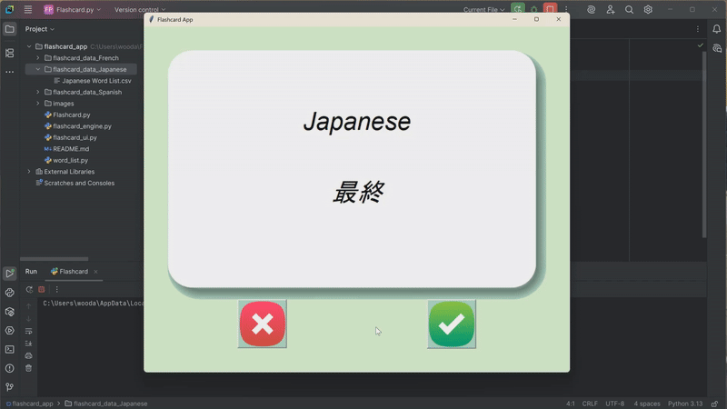

# 🧠 Language Flashcard App

A simple and customizable flashcard app built with Python and Tkinter to help users learn vocabulary in multiple languages. 
Just change one variable to switch languages! The app comes with files for Japanese, French, and Spanish installed.


---

## ✨ Features

- 🔁 Auto-flipping flashcards (front: target language, back: English)
- ✅ Mark words as known to remove them from rotation
- ✅ Easily add words you are currently studying
- 📁 Supports multiple languages via dynamic file paths
- 🗂 Modular design using OOP (separate UI, logic, and data loading)
- 💾 Progress saved to CSV files for persistence

---

## 📸 Demo


---

## 🔧 Getting Started

### Prerequisites

- Python 3.x
- `pandas` library

### Installation

1. **Clone the repository**
   ```bash
   git clone https://github.com/JustinWoo20/flashcard-app.git
   cd flashcard-app
2. Run the app
    The main app is the flashcard.py file

## 🔤 Adding a New Language
Overtime I will periodically add languages, but in the meantime it's easy to add your own language in a couple of steps.
Be sure you are consistent with spelling and capitalization when naming folders and setting the language variable.

1. Create a new folder named "flashcard_data_<language>"
    For example, if you want to add Chinese, your folder name will look like "flashcard_data_Chinese"
2. Add your word list titled "<language> Word List". It should have two columns inside the file.
   ex. Chinese Word List
   The first language is your target language and the second is English. 
    "Chinese", "English"
3. Update the language variable in the the word_list.py file
    language = "Chinese"
The app will now use your custom word list.

## Updating an Existing Word List
Simply add your words at the end in any of the word list files.

## 🧠 Why I Built This
I created this project to improve my own language learning process and solidify my understanding of Python, object-oriented programming, and GUI development.
It's a portfolio piece and something I wish I had when I started learning Japanese.

### 📂 Project Structure
flashcard-app/

    flashcard.py              # Main script
    flashcard_ui.py           # UI code (Tkinter)
    flashcard_engine.py       # Core app logic
    word_list.py              # Data import logic and language variable
    flashcard_data_Japanese/  # Data folder sample
        Japanese Word List.csv
        Japanese Known Words.csv  # Appears once you get started
    images/                   # Flashcard and button images
        card_front.png
        card_back.png
        flashcard_app_demo.gif
        right.png
        wrong.png
        README.md                 # This file

## 🚀 Future Improvements
Track stats (accuracy, streaks)

UI language toggles

Export/import known words between devices

## 📝 License
This project is open-source and free to use under the MIT License.

## 🙋‍♂️ Contact
Feel free to reach out with feedback or suggestions

Justin

[https://github.com/JustinWoo20]